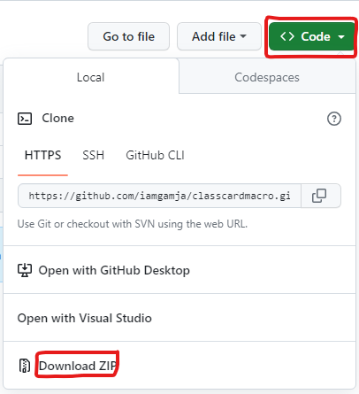
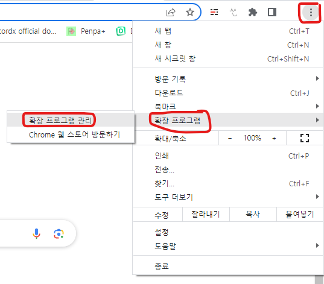
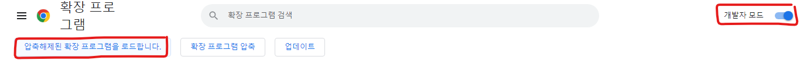

# classcardmacro

⚠️ **주위!** 컴퓨터에서만 가능합니다

  
저는 폰인데요

  알빠임?

## 다운로드 방법

1. 회오리 들어가십시오

2. Code -> Download ZIP 클릭하십시오

3. 압축을 푸십시오

4. 회오리에서 점 3개 -> 확장 프로그램 -> 확장 프로그램 관리 들어가십시오

5. 개발자 모드를 켜고 "압축해제된 확장 프로그램을 로드합니다." 클릭하십시오

6. 압축 푼 폴더를 선택하십시오

7. https://www.classcard.net/ClassMain/938116 접속하고 로그인하십시오

8. START 버튼을 클릭하면 자동으로 실행됩니다.

와!
